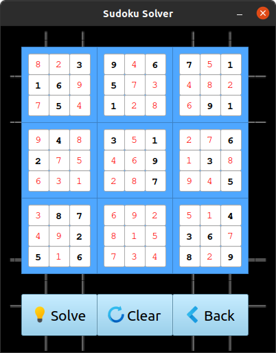

# Sudoku Solver

## Sudoku

Sudoku is a is a logic-based, combinatorial, number-placement puzzle. The objective of 
sudoku is to place numbers in 9x9 grid in such way that there is no reptition in the
columns, rows and even in 3x3 subgrid.

## Solver

This python program can solve any sudoku board that has a solution through backtracking method in O(n2) time.
Custom boards can be given via text file.

## Prerequisites

Requires PyQt5 library.

## How to use

1. Run sudoku-solver.pyw

2. Click Play or check Quicksolve and click Play.

3. Select any difficulty.

4. Click solve to auto solve your board.

5. To use custom board, create a file called "custom.txt" to brds/ .

6. Enter any digit between 1-9 and for empty box enter 0.

7. The grid must be 9x9.

## Images

**Title Window**

**Difficulty Menu**

**Board Window**

